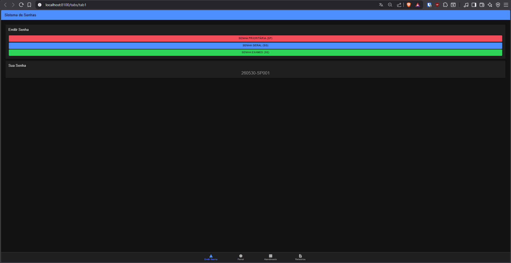
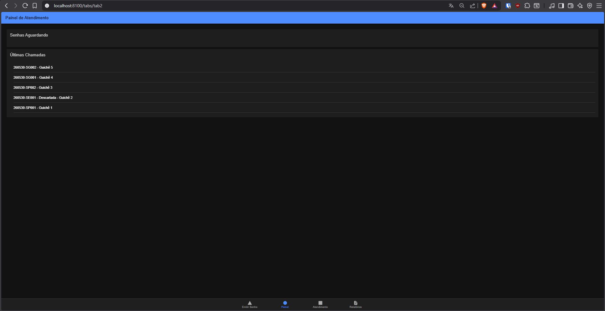
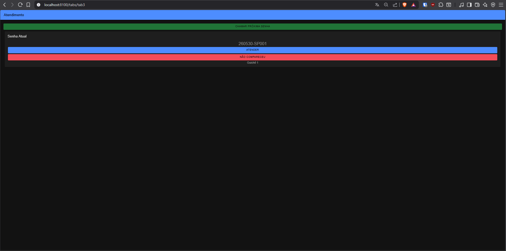
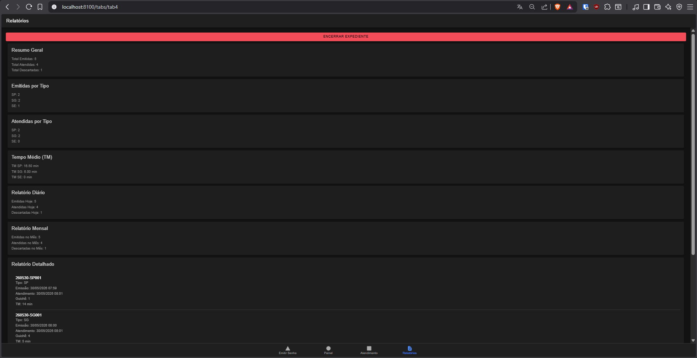

# MobileTicketsIonic

Sistema de gerenciamento de senhas para atendimento em laboratórios médicos, desenvolvido com Ionic e Angular.

## Descrição

O projeto simula um sistema de controle de filas utilizado em laboratórios médicos, permitindo a emissão, gerenciamento e atendimento de senhas de diferentes prioridades.

O sistema foi desenvolvido como atividade acadêmica da disciplina de Desenvolvimento Mobile.

---

## Tecnologias Utilizadas

- Ionic Framework
- Angular
- TypeScript
- HTML
- SCSS

---

## Funcionalidades

### Emissão de Senhas

O sistema permite emitir três tipos de senhas:

- SP – Senha Prioritária
- SG – Senha Geral
- SE – Senha para Retirada de Exames

Formato das senhas:

```text
YYMMDD-PPSQ
```

Exemplo:

```text
260530-SP001
```

Onde:

- YY = ano
- MM = mês
- DD = dia
- PP = tipo da senha
- SQ = sequência da senha por prioridade

---

### Controle de Filas

As filas são separadas por prioridade:

- Fila SP
- Fila SG
- Fila SE

---

### Regra de Atendimento

O sistema respeita a regra:

```text
SP → SE|SG → SP → SE|SG
```

Garantindo alternância entre senhas prioritárias e não prioritárias.

---

### Atendimento

O atendente pode:

- Chamar próxima senha
- Atender senha
- Registrar ausência do cliente

Cada atendimento é associado automaticamente a um guichê.

---

### Controle de Guichês

O sistema utiliza 5 guichês:

```text
Guichê 1
Guichê 2
Guichê 3
Guichê 4
Guichê 5
```

Os guichês são utilizados em rotação automática.

---

### Histórico

O painel mantém registro das:

- Últimas 5 senhas chamadas

---

### Controle de Expediente

Horário de funcionamento:

```text
07:00 às 17:00
```

Fora desse horário:

- Não é possível emitir senhas
- Não é possível iniciar novos atendimentos

Ao encerrar o expediente:

- As senhas pendentes são descartadas

---

### Tempo Médio (TM)

O sistema calcula o tempo médio de atendimento para cada tipo de senha.

#### SP

Tempo médio base:

```text
15 minutos
```

Variação:

```text
10 a 20 minutos
```

#### SG

Tempo médio base:

```text
5 minutos
```

Variação:

```text
2 a 8 minutos
```

#### SE

Probabilidades:

```text
95% → 1 minuto
5% → 5 minutos
```

---

## Relatórios

O sistema disponibiliza:

### Relatório Geral

- Total de senhas emitidas
- Total de senhas atendidas
- Total de senhas descartadas

### Relatório por Tipo

- SP emitidas
- SG emitidas
- SE emitidas

### Relatório de Atendimento

- SP atendidas
- SG atendidas
- SE atendidas

### Relatório Diário

- Emitidas hoje
- Atendidas hoje
- Descartadas hoje

### Relatório Mensal

- Emitidas no mês
- Atendidas no mês
- Descartadas no mês

### Relatório Detalhado

Informações registradas:

- Número da senha
- Tipo
- Data/hora de emissão
- Data/hora de atendimento
- Guichê responsável
- Tempo médio de atendimento
- Status

---

## Telas do Sistema

### Emissão de Senhas



---

### Painel de Atendimento



---

### Atendimento



---

### Relatórios



---

## Estrutura do Projeto

```text
src/
├── app/
│   ├── models/
│   │   └── ticket.ts
│   │
│   ├── services/
│   │   └── ticket.service.ts
│   │
│   ├── tab1/
│   ├── tab2/
│   ├── tab3/
│   └── tab4/
```

---

## Como Executar

### Instalar dependências

```bash
npm install
```

### Executar aplicação

```bash
ionic serve
```

## Autor

Alexsander Dowsley

---

## Licença

Projeto desenvolvido exclusivamente para fins acadêmicos.
